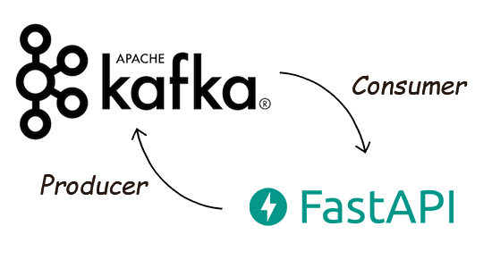

# Kafka with Python (Fast API)

In the previous topic we made kafka topics with the help of cli, In this blog we will build kafka topics with the help of python

## Install Kafka withd docker 
> Previous Blog Link: https://medium.com/dev-genius/kafka-installtions-and-kafka-topics-f0b7c81754d8

## Installation
1. Install python >= 3.6
2. [make virtual env]([https://www.freecodecamp.org/news/how-to-setup-virtual-environments-in-python/])
3. Run command ``` pip install -r requirements.txt```

## Code Part
After installing all of the things, now lets dive into the code part, Our kakfa instances are running on port ```9092, 9093, 9094``` so lets write that in env file.

**Env File**
```bash
BOOTSTRAP-SERVERS="localhost:9092,localhost:9093,localhost:9094"
TOPIC_PEOPLE_BASIC_NAME="people.basic.python"
TOPIC_PEOPLE_BASIC_PARTITIONS=3
TOPIC_PEOPLE_BASIC_REPLICATION_FACTOR=3
```

## Python code

**Imports**
```python
import os
# env and Fast api import
from dotenv import load_dotenv
from fastapi import FastApi
# Kafka Imports
from kafka import KafkaAdminClient
from kafka.admin import NewTopic
from kafka.errors import TopicAlreadyExistsError
```

**Setting up Fast API**
```python
# Load env file
load_dotenv(verbose=True)
# Fast API instance
app = FastApi()
```
**startup event**
To add a function that should be run before the application starts, declare it with the event
lets make a startup event in which we initilise our admin client with all of the our broker servers we mentioned in env file
```python
@app.on_event("startup")
async def startup_event():
    # Kafka Admin Client
    client = KafkaAdminClient(
        bootstrap_servers=os.environ.get("BOOTSTRAP-SERVERS"))
    # Creating topic
    topic = NewTopic(name=os.environ.get("TOPIC_PEOPLE_BASIC_NAME"),
                     num_partitions=int(os.environ.get("TOPIC_PEOPLE_BASIC_PARTITIONS")),
                     replication_factor=int(os.environ.get("TOPIC_PEOPLE_BASIC_REPLICATION_FACTOR")))
    # If topic already exists, it will throw an error
    try:
        # Creating topic
        client.create_topics(new_topics=[topic], validate_only=False)
    except TopicAlreadyExistsError:
        pass
    finally:
        # Close the client
        client.close()

@app.get("/")
async def root():
    return {"message": "Hello World"}
```

**Run Command on terminal**
```bash
uvicorn app:app --reload
```

**Output**
```bash
INFO:     Will watch for changes in these directories: ['/home/sohaib/Documents/Kafka/kafka_python']
INFO:     Uvicorn running on http://127.0.0.1:8000 (Press CTRL+C to quit)
INFO:     Started reloader process [25125] using watchgod
INFO:     Started server process [25127]
INFO:     Waiting for application startup.
Creating topic people.basic.python
INFO:     Application startup complete.
```

**Verify things**
Nows lets verify if our topic is created on kafka or not

Run command
```bash
docker exec -it cli-tools kafka-topics --list --bootstrap-server broker0:29092,broker1:29093,broker2:29094
```
Output


So we have successfully made a kafka-topic with python

## Advance config while creating topic
To add advance config to the topics while creating through the python, you just need to add one param in topics ```topic-config```

like the code below
```python
topic = NewTopic(name=os.environ.get("TOPIC_PEOPLE_BASIC_NAME"),
                     num_partitions=int(os.environ.get("TOPIC_PEOPLE_BASIC_PARTITIONS")),
                     replication_factor=int(os.environ.get("TOPIC_PEOPLE_BASIC_REPLICATION_FACTOR")),
                     topic_configs={"cleanup.policy": "compact"})
```

## Advance config while updating topic
To update the advance config of the topics, you can use this code.
```python
    # Updating Kafka Config
cfg_resources_update = ConfigResource(
    ConfigResourceType.TOPIC,
    os.environ.get("TOPIC_PEOPLE_BASIC_NAME"),
    configs={"retention.ms": "360"})
client.alter_configs([cfg_resources_update])
```

## Verify Advance config
To verify the advance config, you can use this command
```bash
docker exec -it cli-tools kafka-topics --describe all --bootstrap-server broker0:29092,broker1:29093,broker2:29094 --topic people.basic.python
```
Output
